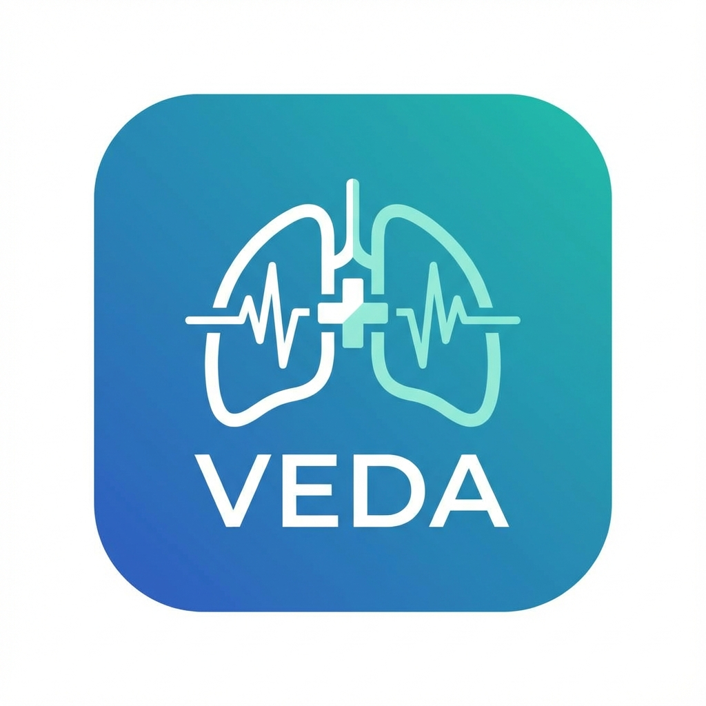

# VEDA (Ventilation & Emergency Dosing Assistant)
VEDA is a comprehensive cross-platform medical calculator designed for emergency healthcare professionals. It provides rapid, precise calculations for mechanical ventilation parameters and emergency drug dosing, alongside interactive medical algorithms.

## 🌟 Key Features
### 🫁 Ventilation Calculator
*   **Precision Dosing**: Calculates Tidal Volume (6-8 ml/kg) based on Predicted Body Weight (PBW).
*   **Minute Ventilation**: Real-time logic to estimate Minute Ventilation (L/min).
*   **Tube Depth**: Estimates appropriate ETT insertion depth based on patient interface.
*   **Smart Defaults**: Pre-populates Respiratory Rate based on age group logic.
*   **Input Validation**: Safety checks for unrealistic height/weight values.
### 💊 Emergency Drug Dosing
*   **RSI (Rapid Sequence Induction)**: Inducers and Paralytics (Ketamine, Propofol, Rocuronium, etc.).
*   **Resuscitation**: Adrenaline, Amiodarone, and more.
*   **Shock & Support**: Pressors and Inotropes.
*   **Pediatric Safety**: Automatic weight-based calculations for Neonates and Pediatrics.
### ⚡ Interactive Algorithms
*   **ALS (Adult Life Support)**: Interactive checklist and flowchart for Cardiac Arrest (30:2).
*   **EPALS (Paediatric Life Support)**: Guidelines for pediatric emergencies (15:2).
*   **Difficult Airway**: LEMON assessment and critical checklists.
*   **Zoomable Assets**: High-resolution algorithm charts integrated directly into the UI.
## 🌍 Localization
Fully localized interface supporting:
*   🇬🇧 English
*   🇫🇷 French
*   🇪🇸 Spanish
## 🛠 Tech Stack
*   **Framework**: Flutter (Dart)
*   **Design**: Custom "Glassmorphism" UI with `GoogleFonts.outfit`.
*   **Localization**: `flutter_localizations` with ARB files.
*   **Assets**: SVG and PNG support with `flutter_launcher_icons`.
## 🚀 Getting Started
### Prerequisites
*   Flutter SDK (Stable)
*   VS Code / Android Studio
### Installation
1.  Clone the repository:
    ```bash
    git clone https://github.com/DrZAIER/veda-medical-app.git
    ```
2.  Install dependencies:
    ```bash
    flutter pub get
    ```
3.  Generate Localizations:
    ```bash
    flutter gen-l10n
    ```
4.  Run the app:
    ```bash
    flutter run -d chrome
    # or
    flutter run -d android
    ```
## 📦 Production Build
To generate a release bundle for the Play Store:
```bash
flutter build appbundle
```
*Refer to `deployment_guide.md` for signing configurations.*
## 📄 License
Apache 2.0 License
